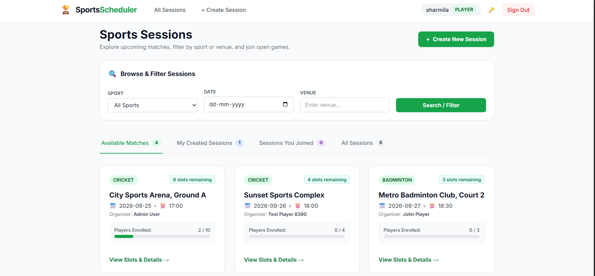
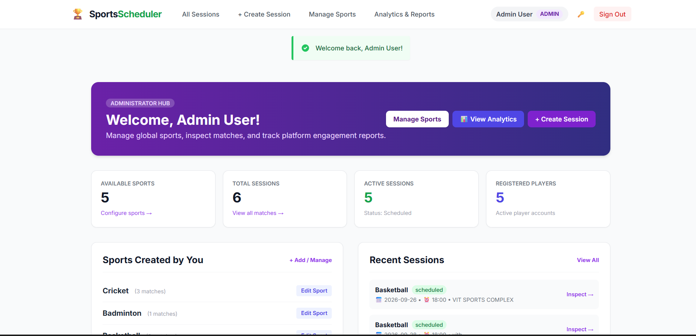
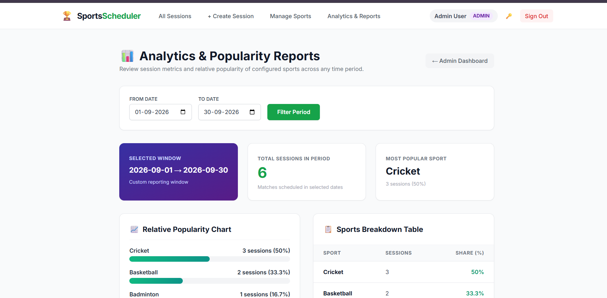
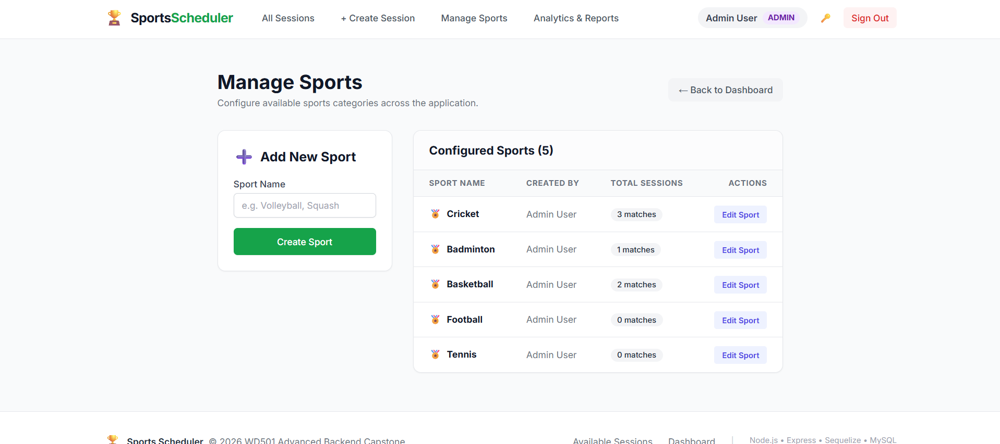
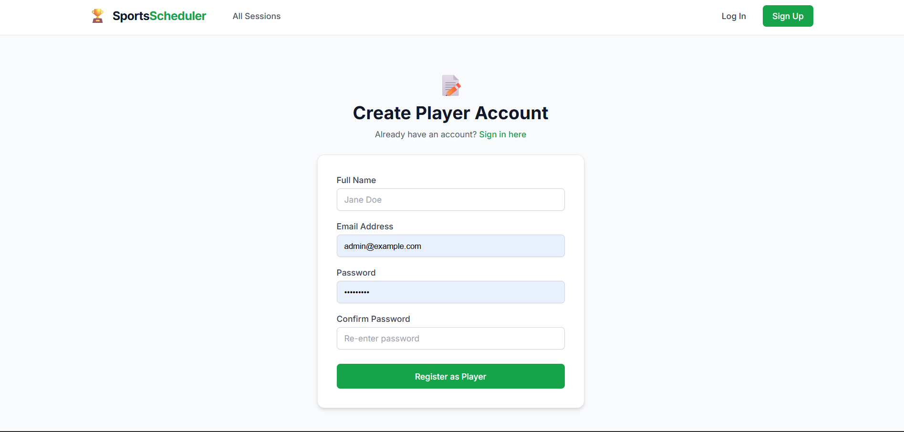
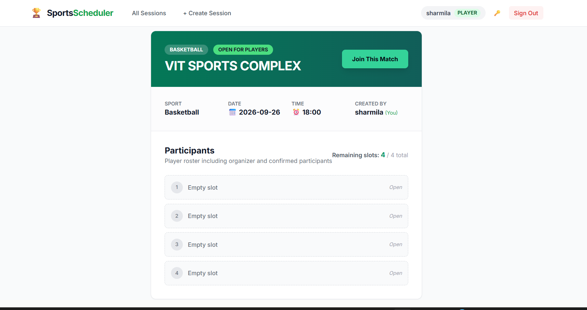

# Sports Scheduler - WD501 Advanced Backend Capstone Project

[svg](https://github.com/24pa1a12h8-hub/sports-scheduler#sports-scheduler---wd501-advanced-backend-capstone-project)

A complete, production-ready full-stack web application built for the **WD501 Advanced Backend** curriculum. The platform enables administrators to manage available sports categories and view deep analytical reports on sport popularity, while allowing players to create, discover, join, and cancel sports matches with live participant slot tracking and schedule conflict detection.

---

## 🌐 Live Demo & Video

**Deployed Application:** https://sports-scheduler-ncdh.onrender.com

**Project Demonstration Video:** https://youtu.be/VH6sU93WEcg?si=JI7MDgnRcA71pnfL

---

## 🌟 Key Features

[svg](https://github.com/24pa1a12h8-hub/sports-scheduler#-key-features)

### 👤 Administrator Persona

[svg](https://github.com/24pa1a12h8-hub/sports-scheduler#-administrator-persona)

- **Secure Authentication**: Admin login using email and password with bcryptjs hashing and session management.
- **Dedicated Admin Hub**: Real-time KPI counters for sports, total matches, active sessions, and registered players.
- **Sports Category Management**:
  - Create new official sports (validates non-empty names, prevents duplicates).
  - Edit existing sports.
  - View all sports created with associated match counts.
- **Analytics & Popularity Reports**:
  - Filter by custom date ranges (`startDate` to `endDate`).
  - Total matches played/scheduled within the period.
  - Breakdown by sport with session counts and relative popularity percentages.
  - Responsive visual popularity bar chart and tabular breakdown.
- **Full Operational Access**: Create sessions, join sessions, and cancel sessions as needed.

### ⚽ Player Persona

[svg](https://github.com/24pa1a12h8-hub/sports-scheduler#-player-persona)

- **Player Registration & Sign In**:
  - Name, valid email format, min 6-char password, password confirmation.
  - Automatic role enforcement (`player` role only; admin privilege escalation blocked).
  - Secure bcryptjs password hashing (passwords never stored in plain text).
- **Player Dashboard**:
  - Personalized overview showing enrolled sessions and created sessions.
  - Quick actions to browse sessions or host a new match.
- **Sport Session Lifecycle**:
  - **Create Sessions**: Choose from admin-configured sports, pick future date & time, specify venue, and define participant slots needed. Rejects past dates/times.
  - **Browse & Filter**: Switch between *Available Matches*, *My Created Sessions*, *Sessions You Joined*, and *All Sessions*.
  - **Live Participant Slots**: Rich session view displaying organizer, numbered player slots (`1. Player Name`, `2. Player Name`, `3. Empty slot`, ...), and real-time remaining slots counter.
  - **Join Sessions**: Join available matches with instant capacity validation; blocks duplicate joining, full sessions, past sessions, or creator self-joining.
  - **Time Conflict Detection (Course Optional Feature)**: Automatically blocks a player from joining or creating overlapping sessions occurring at the exact same date and time.
  - **Session Cancellation**: Creator (or admin) can cancel a session by providing a mandatory reason. Cancelled matches show a red cancellation banner, display the cancellation reason, and block any new joins.
- **Self-Service Security (Course Optional Feature)**:
  - Authenticated password change requiring verification of current password before updating.

---

## 🛠️ Technology Stack

[svg](https://github.com/24pa1a12h8-hub/sports-scheduler#%EF%B8%8F-technology-stack)

| **LayerTechnology**     |                                                                     |
| ----------------------- | ------------------------------------------------------------------- |
| **Runtime & Framework** | Node.js (v24.x) + Express.js                                        |
| **Database & ORM**      | MySQL 8.4 + Sequelize ORM (with Sequelize CLI migrations & seeders) |
| **Authentication**      | Passport.js (`LocalStrategy`), `express-session`, `bcryptjs`        |
| **Flash Messages**      | `connect-flash`                                                     |
| **Views / UI**          | EJS Templates + Tailwind CSS (via CDN) + Modern SVG Icons           |
| **Testing**             | Jest + Supertest (32 automated integration tests)                   |
| **Environment**         | `dotenv`, `cross-env`                                               |

---

## 🗄️ Database Design & Models

[svg](https://github.com/24pa1a12h8-hub/sports-scheduler#%EF%B8%8F-database-design--models)

- **`Users`**: `id`, `name`, `email` (unique), `passwordHash`, `role` (`admin` | `player`), `createdAt`, `updatedAt`.
- **`Sports`**: `id`, `name` (unique), `userId` (FK -> `Users.id`), `createdAt`, `updatedAt`.
- **`Sessions`**: `id`, `sportId` (FK -> `Sports.id`), `creatorId` (FK -> `Users.id`), `date`, `time`, `venue`, `additionalPlayersNeeded`, `status` (`scheduled` | `cancelled`), `cancellationReason`, `createdAt`, `updatedAt`.
- **`SessionParticipants`**: `id`, `sessionId` (FK -> `Sessions.id`), `userId` (FK -> `Users.id`), `joinedAt`, `createdAt`, `updatedAt` (with composite unique index on `[sessionId, userId]`).

---

## 🚀 Getting Started

[svg](https://github.com/24pa1a12h8-hub/sports-scheduler#-getting-started)

### 1. Prerequisites

[svg](https://github.com/24pa1a12h8-hub/sports-scheduler#1-prerequisites)

- [Node.js](https://nodejs.org/) (v18 or higher; tested on v24)
- [MySQL Server](https://www.mysql.com/) (v8.0 or higher; tested on v8.4)

### 2. Environment Configuration

[svg](https://github.com/24pa1a12h8-hub/sports-scheduler#2-environment-configuration)

Copy `.env.example` to `.env` and adjust your MySQL credentials:

```
cp .env.example .env
```

**svg**

Example `.env`:

```
PORT=3000
NODE_ENV=development
DB_HOST=127.0.0.1
DB_PORT=3306
DB_USER=root
DB_PASSWORD=your_mysql_password
DB_NAME=sports_scheduler_development
DB_TEST_NAME=sports_scheduler_test
SESSION_SECRET=super_secret_session_key_2026
```

**svg**

### 3. Install Dependencies

[svg](https://github.com/24pa1a12h8-hub/sports-scheduler#3-install-dependencies)

```
npm install
```

**svg**

### 4. Run Migrations & Seed Data

[svg](https://github.com/24pa1a12h8-hub/sports-scheduler#4-run-migrations--seed-data)

```
# Run migrations on the development database
npm run migrate

# Seed initial admin, player, sports, and sample sessions
npm run seed
```

**svg**

### 5. Start the Application

[svg](https://github.com/24pa1a12h8-hub/sports-scheduler#5-start-the-application)

```
npm start
```

**svg**

Open your browser at: **`http://localhost:3000`**

---

## 🔑 Default Credentials for Quick Evaluation

[svg](https://github.com/24pa1a12h8-hub/sports-scheduler#-default-credentials-for-quick-evaluation)

| **PersonaEmailPasswordRole** |                      |              |          |
| ---------------------------- | -------------------- | ------------ | -------- |
| **Administrator**            | `admin@example.com`  | `Admin@123`  | `admin`  |
| **Player**                   | `player@example.com` | `Player@123` | `player` |

---

## 🧪 Automated Testing

[svg](https://github.com/24pa1a12h8-hub/sports-scheduler#-automated-testing)

The project includes 32 automated integration tests across 7 comprehensive test suites covering authentication, authorization, sports, sessions, participant slots, cancellation, and admin analytics reports:

```
npm test
```

**svg**

### Test Coverage Highlights:

[svg](https://github.com/24pa1a12h8-hub/sports-scheduler#test-coverage-highlights)

- **Authentication**: Registration, duplicate email rejection, validation, password hashing, login success/failure, logout, and password updates.
- **Role-Based Authorization**: Unauthenticated redirection, normal players blocked from admin dashboards/sports/reports, admin authorized access.
- **Sports Management**: Admin sport creation, duplicate rejection, editing sport names, non-admin restriction.
- **Sessions**: Session creation, past date rejection, invalid input rejection, session catalog display.
- **Participants**: Joining matches, slot deduction, slot roster rendering (`Player Name` vs `Empty slot`), duplicate join prevention, full session prevention, past session prevention, and concurrent schedule conflict prevention.
- **Cancellation**: Creator and admin cancellation with mandatory reason, cancelled session status rendering, join prevention on cancelled matches.
- **Analytics & Reports**: Database aggregation of session counts and percentage calculations per sport over date windows.

---

## 📸 UI Screenshots

### Sports Sessions - Browse & Filter


### Administrator Dashboard


### Analytics & Popularity Reports


### Manage Sports


### Player Registration


### Session Details & Participant Slots


---

## 📄 License

[svg](https://github.com/24pa1a12h8-hub/sports-scheduler#-license)

ISC © 2026 Sharmila Pedireddy - WD501 Advanced Backend Capstone.

## Aboutsvg

*No description, website, or topics provided.*

### Resources

[svgReadme](https://github.com/24pa1a12h8-hub/sports-scheduler#readme-ov-file)

[svgActivity](https://github.com/24pa1a12h8-hub/sports-scheduler/activity)

### Stars

[svg](https://github.com/24pa1a12h8-hub/sports-scheduler/stargazers)[**0**](https://github.com/24pa1a12h8-hub/sports-scheduler/stargazers)[ stars](https://github.com/24pa1a12h8-hub/sports-scheduler/stargazers)

### Watchers

[svg](https://github.com/24pa1a12h8-hub/sports-scheduler/watchers)[**0**](https://github.com/24pa1a12h8-hub/sports-scheduler/watchers)[ watching](https://github.com/24pa1a12h8-hub/sports-scheduler/watchers)

### Forks

[svg](https://github.com/24pa1a12h8-hub/sports-scheduler/forks)[**0**](https://github.com/24pa1a12h8-hub/sports-scheduler/forks)[ forks](https://github.com/24pa1a12h8-hub/sports-scheduler/forks)

## [Releases](https://github.com/24pa1a12h8-hub/sports-scheduler/releases)

No releases published

[Create a new release](https://github.com/24pa1a12h8-hub/sports-scheduler/releases/new)

## [Packages](https://github.com/users/24pa1a12h8-hub/packages?repo_name=sports-scheduler)

No packages published
[Publish your first package](https://github.com/24pa1a12h8-hub/sports-scheduler/packages)

## Contributors

No contributors

## Languages

- [**JavaScript**](https://github.com/24pa1a12h8-hub/sports-scheduler/search?l=javascript)[54.9%](https://github.com/24pa1a12h8-hub/sports-scheduler/search?l=javascript)
- [**EJS**](https://github.com/24pa1a12h8-hub/sports-scheduler/search?l=ejs)[44.9%](https://github.com/24pa1a12h8-hub/sports-scheduler/search?l=ejs)
- [**Dockerfile**](https://github.com/24pa1a12h8-hub/sports-scheduler/search?l=dockerfile)[0.2%](https://github.com/24pa1a12h8-hub/sports-scheduler/search?l=dockerfile)

## Suggested workflows

Based on your tech stack

1. Publish Node.js Package to GitHub Packages logo

   **Publish Node.js Package to GitHub Packages**Publishes a Node.js package to GitHub Packages.By GitHub Actions
2. Publish Docker Container logo

   **Publish Docker Container**Build, test and push Docker image to GitHub Packages.By GitHub Actions
3. Webpack logo

   **Webpack**Build a NodeJS project with npm and webpack.By GitHub Actions

[More workflows](https://github.com/24pa1a12h8-hub/sports-scheduler/actions/new)

## Footer

[svg](https://github.com/)© 2026 GitHub, Inc.

### Footer navigation

- [Terms](https://docs.github.com/site-policy/github-terms/github-terms-of-service)
- [Privacy](https://docs.github.com/site-policy/privacy-policies/github-privacy-statement)
- [Security](https://github.com/security)
- [Stat](https://www.githubstatus.com/)